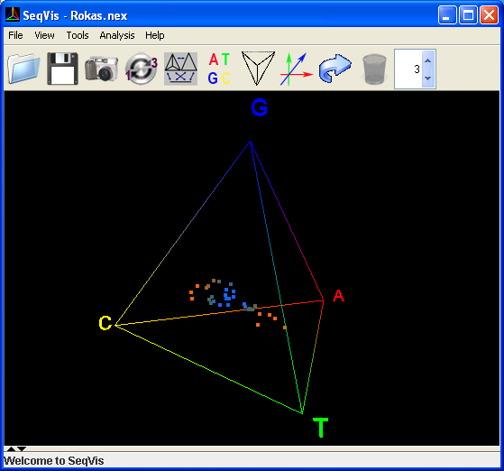

SeqVis: Visualization of compositional heterogeneity in large alignments of nucleotides
==========================================================




SeqVis is a stand-alone, platform-independent Java application developed to facilitate analysis and 3D visualization of compositional heterogeneity in species-rich alignments of nucleotide sequences. Each sequence is represented by a dot in a tetrahedron plot (i.e., an extension of the de Finetti), where the position of the dot depends uniquely on the nucleotide content of that sequence. SeqVis also allows users to analyse their data set using, for example, the useful matched-pairs test of symmetry. More details can be found in our publication (Ho et al. 2005)

Ho JWK, Adams CE, Lew JB, Matthews TJ, Ng CC, Shahabi-Sirjani A, Tan LH, Zhao Y, Easteal S, Wilson SR, Jermiin LS (2006). [SeqVis: Visualization of compositional heterogeneity in large alignments of nucleotides](https://academic.oup.com/bioinformatics/article/22/17/2162/273417). Bioinformatics 22, 2162-2163.

More details can be found at [http://bioinformatics.victorchang.edu.au/seqvis/](http://bioinformatics.victorchang.edu.au/seqvis/)

*SeqVis* is maintained by Dr Joshua Ho <j.ho@victorchang.edu.au>.


Note
---------------

- Make sure a [Java Runtime Enrivonment](https://java.com/en/download/) is available on your operating system 
- Please download and install [Java3D](http://www.oracle.com/technetwork/java/javasebusiness/downloads/java-archive-downloads-java-client-419417.html#java3d-1.5.1-oth-JPR)
- Download seqvis.jar. This is the main program. 
- You can then run *SeqVis* using the following command:

``` Java
## this is a Java command
java -cp . -jar seqvis.jar
```
